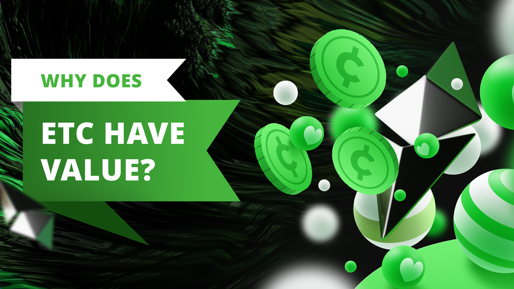
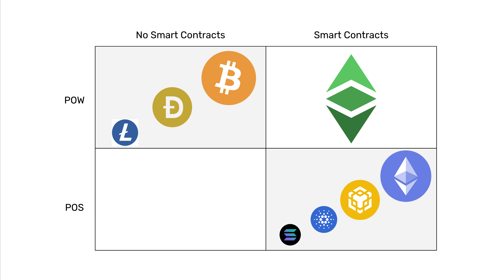

---
**You can listen to or watch this video here:**

<iframe width="560" height="315" src="https://www.youtube.com/embed/s4WN5VEd-Uc" title="YouTube video player" frameborder="0" allow="accelerometer; autoplay; clipboard-write; encrypted-media; gyroscope; picture-in-picture; web-share" allowfullscreen></iframe>

---

In the previous classes, 28 and 29, we made comparisons between proof of work (POW) and proof of stake (POS) from the standpoint of censorship resistance and their regulatory status as commodities or securities.

In this class, 30, we will apply these ideas to Ethereum Classic (ETC) in particular to explain why it has value.

Given the history and current positionings of Ethereum and Ethereum Classic, and the fact that ETC seems like a secondary chain, we will explain its advantages, and why it should be one of the biggest blockchains in the world.

## The Core of ETC

Many in the industry ask themselves, why does ETC have value? 

The core reason is that ETC is a POW blockchain, with a fixed monetary policy, that supports smart contracts inside its highly secure environment.

This combination of attributes make ETC programmable digital gold.

Proof of work is the only true decentralized design to keep a blockchain permissionless. This is more clear as time passes by and we see censorship and instability in other systems.

A fixed monetary policy with a supply cap, combined with POW, makes ETC hard money, and hard money makes it digital gold just like Bitcoin (BTC).

Smart contracts are the component that add programmability to the equation, making ETC unique.

## ETC’s Secure Internal Environment

The attributes mentioned above make ETC very attractive because applications can exist inside its highly secure environment, rather than outside with insecure connections.

Bitcoin, for example, has solutions such as [RSK](https://www.investopedia.com/news/what-rsk-it-threat-ethereum/) and [BitVM](https://bitvm.org/) to add smart contracts to its system, but they are external devices and designs that will never achieve the security of having the decentralized programs inside its POW environment.

In ETC, the ledger with accounts and balances supports the addition of smart contracts, therefore making ETC programmable money, also known as “programmable digital gold”.

## ETC’s Positioning

In terms of positioning, that ETC is POW and has smart contracts is a very valuable position because, after the move by Ethereum to proof of stake, ETC remained as the largest POW programmable blockchain that is digital gold in the world.

Great systems such as Bitcoin, DOGE, and Litecoin, are POW blockchains, but only support a ledger with accounts and balances, therefore the most that may be done inside their POW environments is to move coins from one address to the other.

Ethereum, BNB Smart Chain, Cardano, Solana, and the other POS smart contracts networks can’t equal the security of POW in ETC. This positions them as programmable blockchains, but they cannot be digital gold as ETC is. They are better described as programmable community fiat money.

## Why Does the Market Not See Ethereum Classic’s value

The above reasons are why ETC has so much value, but then the question is, why does the market not see this? 

And the answer is that because of the enormous amounts of hype and money that the Ethereum Foundation and ICO funded POS projects still have.

These organizations and communities have the ability to continue to misinform the market saying that POS is more secure, more scalable, more innovative, that it saves the trees, and all those falsehoods. 

Unfortunately, this is how things work nowadays in the world. Ethics and truth are last, but opportunism and disinformation are first.

## Time Will Make Clear Which Blockchains Are Truly Decentralized

However, in the blockchain industry the truth eventually emerges because people will pay with their wealth and basic rights the costs of centralization. 

Then, ETC will likely be more widely recognized.

In time, it will be obvious that the combination of POW + digital gold + programmability has enormous value, that POS is centralized, so the rankings will adjust accordingly.

In a way, POS and proof of authority (POA) systems are traps. People are flocking to them, investing their savings and using their dapps, but when they are locked in, then governments will likely capture these networks and then people will feel betrayed. 

Only in systems such as ETC it is possible to not comply with the techno-tyranny that is coming.

## Applications in Ethereum Classic Are the Most Secure in the World

So, as ETC is Bitcoin but programmable, then what we wrote in class 16 of this course is affirmed;

*“In summary, Ethereum Classic is the environment where the most secure applications in the world will exist because it is a proof of work blockchain, therefore truly decentralized; it has a fixed monetary policy, therefore it is sound money; and it is programmable, therefore much more versatile and secure than the alternatives.*

*In addition to these qualities, ETC is a fully replicated blockchain, which increases its safety; and composable, which reduces risks and settlement costs; and is the largest one in the world with this combined design!*

*These attributes in the same integrated system provide the highest level of decentralization, thus trust minimization, thus security for any application hosted in it.”*

---

**Thank you for reading this article!**

To learn more about ETC please go to: https://ethereumclassic.org
